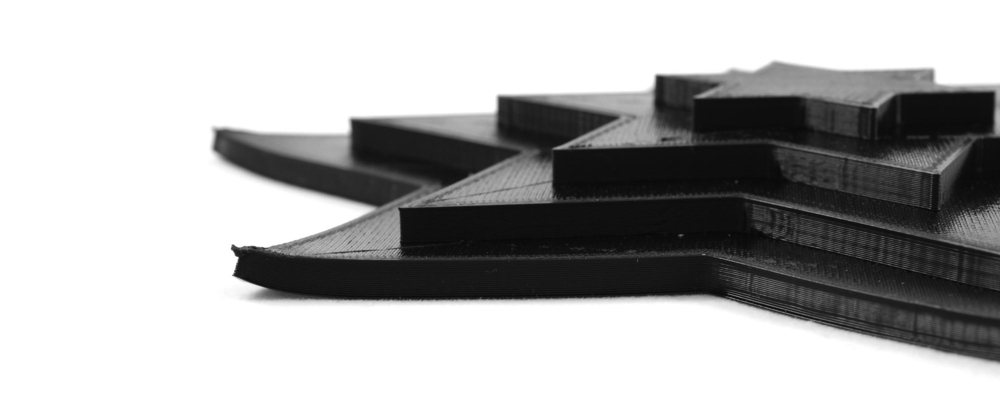

Deformace
====
Deformace je problém v konečném tisku, kdy se tisk po tisku kroutí a výsledný objekt zůstane zdeformovaný. Obvykle se spodní rohy tisku prohnou nahoru nebo se jemné části tisku zvlní.

Příčina
----
Deformace je způsobena kombinací vlivů, ale hlavně vnitřním napětím v důsledku tahem trysky na roztavený plast. Když je ve skleněném přechodu, plast se chová trochu jako guma. Pokud za něj zatáhnete, materiál se natáhne, ale pokud přestanete tahat, vrátí se do původního tvaru. Totéž se stane i při tisku. Když tisknete dlouhou linii, tryska se táhne za plastovou linii, která protahuje délku linie. Když se tryska vzdálí a přestane tahat, plastová linie se smrští. Tato kontrakce způsobí tah na všechno, co je k ní připojeno. Pokud se dost plastových linií vytáhne najednou, mohou deformovat tisk. To je zvláště běžné, když je mnoho rovnoběžných linií, například v plášti.

Druhým efektem, který způsobuje deformaci, je smrštění materiálu, když se ochladí. Většina materiálů má tendenci se zmenšovat, když chladnou. Pokud objekt vychladne nerovnoměrně, některé části tisku se zmenšují více než jiné, což objekt zkresluje. Jak objekt pokračuje v chládnutí, tuhne více, což ho trvale deformuje.

Některé materiály jsou citlivější na smršťování než jiné. Zde jsou uvedeny některé koeficienty smrštění pro běžné materiály pro 3D tisk. To je přibližně množství smrštění každého typu materiálu, který se ochlazuje ze svého skelného přechodu na teplotu okolí. Mezi směsmi dochází k určité odchylce. Větší smrštění způsobí větší deformaci.
* PLA: 0,21%.
* ABS: 0,70%.
* TPU: 0,63%.
* HIPS: 0,64%
* PETG a CPE: 0,45%.
* Nylon: 0,62%
* PC: 0,70%.
* PP: 1,2%

Kromě toho lze zabránit deformaci, pokud jsou v cestě jiné materiály. Pokud je část tisku zcela hustá, okolní materiál se může zmenšovat méně nebo vůbec. Pokud nejsou jiné části zcela husté, dostanete částečně zmenšený výtisk. Zmenšená část tisku vytáhne zbytek, což může také způsobit deformaci. Tento jev je běžný na hranici mezi pláštěm a výplní, protože plášť je zcela hustý, ale výplň není.

Deformace je nejčastější ve spodní části tisku. To je místo, kde je teplotní gradient největší, protože spodní část tisku je často zahřívána topným ložem a zbytek tisku ne. Spodní strana je obvykle tvořena mnoha dlouhými liniemi pláště. Pokud je [dolní vzor](../top_bottom/top_bottom_pattern.md) nastaven na lineární nebo cikcak, jsou tyto linie dlouhé, rovné a rovnoběžné, což jim umožňuje působit ve stejném směru a deformovat objekt.

Prevence
----
* Pokud se na spodní straně tisku objeví deformace, nastavte [dolní vzor pro počáteční vrstvu](../top_bottom/top_bottom_pattern_0.md) na soustředný. Tímto způsobem již nebude možné spodní linie pláště jednotně stahovat. Vnitřní napětí bude uvnitř spodní vrstvy rovnoměrně rozloženo. Pokud to nestačí k zabránění deformací, můžete také nastavit obyčejný [horní/dolní vzor](../top_bottom/top_bottom_pattern.md) na soustředný.
* Chcete-li snížit teplotní gradienty uvnitř tisku, snižte [teplotu podložky tisku](../material/material_bed_temperature.md). Objekt by se pak měl ochladit rovnoměrněji.
* V závislosti na hardwaru tiskárny může deformacím bránit také tisk v uzavřené vyhřívané komoře. Na jedné straně se tím sníží rozdíl mezi objemem tisku a deskou a rozdíl mezi objemem tisku a tryskou. To také umožní delší [žíhání](https://en.wikipedia.org/wiki/Annealing_%28glass%29) plastu, čímž se sníží vnitřní napětí a tím i tahání tištěných linií, které způsobují deformaci. Pokud to vaše tiskárna umožňuje, zvažte zvýšení [teploty objemu tisku](../material/build_volume_temperature.md).
* Aby se zabránilo deformaci spodní strany, je užitečné dobré přilnutí tiskové podložky. To zvyšuje sílu potřebnou pro deformaci materiálu. Například zvyšte [šířku krempy](../platform_adhesion/brim_width.md) nebo [šířku raftu](../platform_adhesion/raft_margin.md).
* Použití [raftu namísto krempy](../platform_adhesion/adhesion_type.md) odstraní tisk z tiskové podložky a vloží mezi ně kus pevného plastu, který je navržen tak, aby byl odolný proti deformaci.
* Zkuste tisknout s pomocí [ochranného štítu](../experimental/draft_shield_enabled.md). Ten vytváří kolem vašeho tisku komoru, která zabraňuje ochlazování tisku vnějším průvanem. Mějte však na paměti, že samotný ochranný štít se může také smrsknout. Pokud štít selže, můžete na výtisku vidět hodně strun nebo špaget.
* Tiskněte materiálem, který se méně zmenšuje, například PLA.
* Pokud máte možnost provést úpravy tištěného modelu, zkuste se vyhnout umístění velmi ostrých vnějších rohů na podložku tisku. Můžete se rozhodnout zaoblit některé vnější rohy. Tím se zabrání soustředění veškeré síly vnitřního napětí v jednom bodě, čímž se sníží pravděpodobnost deformace.
