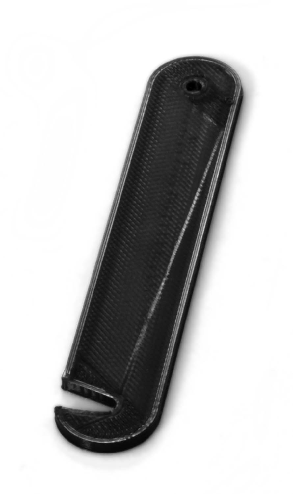

Cicatrice
====
Lorsqu'une empreinte a une grande face supérieure plate, il y a un risque de cicatrices. C'est le cas lorsqu'il y a une ligne clairement visible sur la face supérieure de l'empreinte, qui n'appartient pas au motif normal. Cette ligne marque la surface supérieure, par ailleurs lisse, de l'empreinte.

Les cicatrices sont créées par les mouvements de déplacement qui traversent la surface supérieure. La buse chaude racle la surface, coupant une partie du plastique, faisant légèrement fondre d'autres plastiques et éventuellement suintant un peu plus de matière dans les crevasses. La cicatrice est purement visuelle. Il n'y a pas de différence significative dans la force ou la précision de l'impression. Cependant, si une cicatrice est créée sur la première couche, le frottement pourrait détacher votre couche de la plaque de construction.

Prévention
----
Pour éviter les cicatrices, vous devez empêcher la buse de racler la surface supérieure. Vous pouvez soit éviter la surface supérieure horizontalement (contournage), verticalement (décalage en Z) ou empêcher tout déplacement dessus.
* Si vous réglez le [Mode de détours](../travel/retraction_combing.md) sur "Pas edans la couche externe", la buse évitera de heurter la peau lors d'un déplacement. Lors du déplacement d'un modèle, il est uniquement autorisé à traverser le remplissage et les parois. Comme elle ne traverse pas la peau, vous ne devriez pas avoir de cicatrices. Toutefois, si le mouvement de translation commence ou se termine dans la peau ou lorsqu'il n'y a pas de chemin disponible sans toucher la peau, le mouvement de translation sera droit sans rien toucher et, de préférence, il se rétractera également.
* Activez [Décalage en Z lors d’une rétraction](../travel/retraction_hop_enabled.md) pour que la buse se soulève légèrement avant de passer au-dessus de la surface. Cela permettra de maintenir une certaine distance entre la buse et la surface, de sorte que la buse ne frotte pas. Cela permet également d'éviter une cicatrice. Si vous utilisez un mode contournage, la buse essaiera d'abord d'éviter la peau horizontalement. S'il n'y a pas d'itinéraire disponible, elle se rétractera et de décalera en Z ensuite.
* Il est parfois possible d'éviter un déplacement ou de faire en sorte qu'un déplacement ne traverse qu'une partie de la peau qui n'a pas encore été imprimée, simplement en ajustant les [sens de la ligne du dessus / dessous](../top_bottom/skin_angles.md). Cura commandera les lignes pour minimiser le temps de déplacement, mais ne donne pas beaucoup de contrôle sur cette commande. En faisant tourner les lignes de la peau, ou en faisant tourner le modèle, toutes les lignes s'ajustent différemment, l'ordre d'impression sera différent et cela rend les déplacements différents. Il ne sera peut-être plus nécessaire d'effectuer un déplacement. Il s'agit cependant d'un processus d'essais et d'erreurs.
